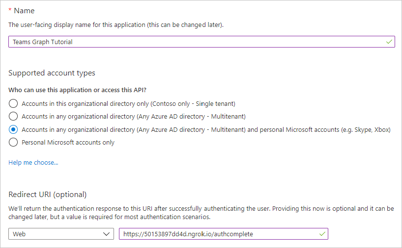

<!-- markdownlint-disable MD002 MD041 -->

Dans cet exercice, vous allez créer une inscription de l’application Web Azure AD à l’aide du centre d’administration Azure Active Directory.In this exercise, you will create a new Azure AD web application registration using the Azure Active Directory admin center.

1. Ouvrez un navigateur et accédez au [Centre d’administration Azure Active Directory](https://aad.portal.azure.com).Open a browser and navigate to the [Azure Active Directory admin center](https://aad.portal.azure.com). Connectez-vous à l’aide d’un **compte personnel** (compte Microsoft) ou d’un **compte professionnel ou scolaire**.Login using a **personal account** (aka: Microsoft Account) or **Work or School Account**.

1. Sélectionnez **Azure Active Directory** dans le volet de navigation gauche, puis sélectionnez **Inscriptions d’applications** sous **Gérer**.Select **Azure Active Directory** in the left-hand navigation, then select **App registrations** under **Manage**.

    

1. Sélectionnez **Nouvelle inscription**.Select **New registration**. Sur la page **inscrire une application** , définissez les valeurs comme suit, où `YOUR_NGROK_URL` est l’URL de transfert ngrok que vous avez copiée dans la section précédente.On the **Register an application** page, set the values as follows, where `YOUR_NGROK_URL` is the ngrok forwarding URL you copied in the previous section.

    - Définissez le **Nom** sur `Teams Graph Tutorial`.Set **Name** to `Teams Graph Tutorial`.
    - Définissez les **Types de comptes pris en charge** sur **Comptes dans un annuaire organisationnel et comptes personnels Microsoft**.Set **Supported account types** to **Accounts in any organizational directory and personal Microsoft accounts**.
    - Sous **URI de redirection**, définissez la première flèche déroulante sur `Web`, et la valeur sur `YOUR_NGROK_URL/authcomplete`.Under **Redirect URI**, set the first drop-down to `Web` and set the value to `YOUR_NGROK_URL/authcomplete`.

    

1. Sélectionner **Inscription**.Select **Register**. Sur la page **Didacticiel des graphiques teams** , copiez la valeur de l' **ID d’application (client)** et enregistrez-la, vous en aurez besoin à l’étape suivante.On the **Teams Graph Tutorial** page, copy the value of the **Application (client) ID** and save it, you will need it in the next step.

    

1. Sous **Gérer**, sélectionnez **Authentification**.Select **Authentication** under **Manage**. Recherchez la section **Grant implicite** et activez les **jetons d’accès** et les **jetons ID**.Locate the **Implicit grant** section and enable **Access tokens** and **ID tokens**. Sélectionnez **Enregistrer**.Select **Save**.

1. Sélectionnez **Certificats et secrets** sous **Gérer**.Select **Certificates & secrets** under **Manage**. Sélectionnez le bouton **Nouveau secret client**.Select the **New client secret** button. Entrez une valeur dans **Description**, sélectionnez une des options pour **Expire le**, puis sélectionnez **Ajouter**.Enter a value in **Description** and select one of the options for **Expires** and select **Add**.

1. Copiez la valeur du secret client avant de quitter cette page.Copy the client secret value before you leave this page. Vous en aurez besoin à l’étape suivante.You will need it in the next step.

    > [!IMPORTANT]
    > Ce secret client n’apparaîtra plus jamais, aussi veillez à le copier maintenant.This client secret is never shown again, so make sure you copy it now.

1. Sélectionnez **autorisations d’API** sous **gérer**, puis sélectionnez **Ajouter une autorisation**.Select **API permissions** under **Manage**, then select **Add a permission**.

1. Sélectionnez **Microsoft Graph**, puis **autorisations déléguées**.Select **Microsoft Graph**, then **Delegated permissions**.

1. Sélectionnez les autorisations suivantes, puis **Ajouter des autorisations**.Select the following permissions, then select **Add permissions**.

    - **Calendars. ReadWrite** : permet à l’application de lire et d’écrire dans le calendrier de l’utilisateur.**Calendars.ReadWrite** - this will allow the app to read and write to the user's calendar.
    - **MailboxSettings. Read** : permet à l’application d’obtenir le fuseau horaire, le format de la date et le format de l’heure de l’utilisateur à partir de leurs paramètres de boîte aux lettres.**MailboxSettings.Read** - this will allow the app to get the user's time zone, date format, and time format from their mailbox settings.

    

## Configuration de l’authentification unique teamsConfigure Teams single sign-on

Dans cette section, vous allez mettre à jour l’inscription de l’application pour qu’elle prenne en charge l' [authentification unique dans teams](/microsoftteams/platform/tabs/how-to/authentication/auth-aad-sso).In this section you'll update the app registration to support [single sign-on in Teams](/microsoftteams/platform/tabs/how-to/authentication/auth-aad-sso).

1. Sélectionnez **exposer une API**.Select **Expose an API**. Sélectionnez le lien **définir** en regard de **URI ID d’application**.Select the **Set** link next to **Application ID URI**. Insérez votre nom de domaine de l’URL de transfert ngrok (avec une barre oblique « / » ajoutée à la fin) entre les doubles barres obliques et le GUID.Insert your ngrok forwarding URL domain name (with a forward slash "/" appended to the end) between the double forward slashes and the GUID. L’ID entier doit ressembler à ce qui suit : `api://50153897dd4d.ngrok.io/ae7d8088-3422-4c8c-a351-6ded0f21d615` .The entire ID should look similar to: `api://50153897dd4d.ngrok.io/ae7d8088-3422-4c8c-a351-6ded0f21d615`.

1. Dans la section **étendues définies par cette API** , sélectionnez **Ajouter une étendue**.In the **Scopes defined by this API** section, select **Add a scope**. Renseignez les champs comme suit, puis sélectionnez **Ajouter une étendue**.Fill in the fields as follows and select **Add scope**.

    - **Nom de l’étendue :**`access_as_user`**Scope name:** `access_as_user`
    - **Qui peut consentir ?: administrateurs et utilisateurs****Who can consent?: Admins and users**
    - **Nom d’affichage du consentement de l’administrateur :**`Access the app as the user`**Admin consent display name:** `Access the app as the user`
    - **Description du consentement administratif :**`Allows Teams to call the app's web APIs as the current user.`**Admin consent description:** `Allows Teams to call the app's web APIs as the current user.`
    - **Nom d’affichage du consentement de l’utilisateur :**`Access the app as you`**User consent display name:** `Access the app as you`
    - **Description du consentement de l’utilisateur :**`Allows Teams to call the app's web APIs as you.`**User consent description:** `Allows Teams to call the app's web APIs as you.`
    - **État : activé****State: Enabled**

    

1. Dans la section **applications clientes autorisées** , sélectionnez **Ajouter une application cliente**.In the **Authorized client applications** section, select **Add a client application**. Entrez un ID client dans la liste suivante, activez l’étendue sous les **étendues autorisées**, puis sélectionnez **Ajouter une application**.Enter a client ID from the following list, enable the scope under **Authorized scopes**, and select **Add application**. Répétez cette procédure pour chaque ID client dans la liste.Repeat this process for each of the client IDs in the list.

    - `1fec8e78-bce4-4aaf-ab1b-5451cc387264` (Team mobile/application de bureau)`1fec8e78-bce4-4aaf-ab1b-5451cc387264` (Teams mobile/desktop application)
    - `5e3ce6c0-2b1f-4285-8d4b-75ee78787346` (Application Web Teams)`5e3ce6c0-2b1f-4285-8d4b-75ee78787346` (Teams web application)
