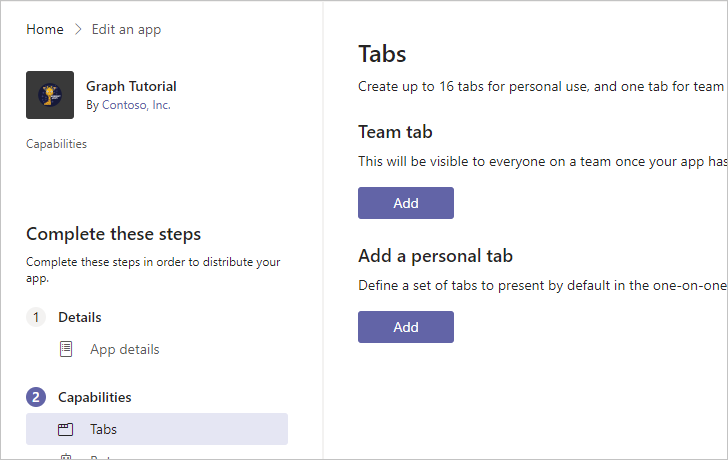

<!-- markdownlint-disable MD002 MD041 -->

Le manifeste de l’application décrit la façon dont l’application s’intègre à Microsoft teams et est nécessaire pour installer des applications.The app manifest describes how the app integrates with Microsoft Teams and is required to install apps. Dans cette section, vous allez utiliser app Studio dans le client Microsoft teams pour générer un manifeste.In this section you'll use App Studio in the Microsoft Teams client to generate a manifest.

1. Si vous n’avez pas encore installé App Studio dans Teams, [Installez-le maintenant](/microsoftteams/platform/concepts/build-and-test/app-studio-overview).If you do not already have App Studio installed in Teams, [install it now](/microsoftteams/platform/concepts/build-and-test/app-studio-overview).

1. Lancez App Studio dans Microsoft teams et sélectionnez l' **éditeur de manifeste**.Launch App Studio in Microsoft Teams and select the **Manifest editor**.

1. Sélectionnez **créer une application**.Select **Create a new app**.

    

1. Sur la page Détails de l' **application** , renseignez les champs obligatoires.On the **App details** page, fill in the required fields.

    > [!NOTE]
    > Vous pouvez utiliser les icônes par défaut dans la section **personnalisation** ou télécharger les vôtres.You can use the default icons in the **Branding** section or upload your own.

1. Dans le menu de gauche, sélectionnez **tabulations** sous **fonctionnalités**.On the left-hand menu, select **Tabs** under **Capabilities**.

1. Sélectionnez **Ajouter** sous **Ajouter un onglet personnel**.Select **Add** under **Add a personal tab**.

    

1. Renseignez les champs comme suit, où `YOUR_NGROK_URL` est l’URL de transfert que vous avez copiée dans la section précédente.Fill in the fields as follows, where `YOUR_NGROK_URL` is the forwarding URL you copied in the previous section. Sélectionnez **Enregistrer** lorsque vous avez fini.Select **Save** when done.

    - **Nom :**`Create event`**Name:** `Create event`
    - **ID d’entité :**`createEventTab`**Entity ID:** `createEventTab`
    - **URL du contenu :**`YOUR_NGROK_URL/newevent`**Content URL:** `YOUR_NGROK_URL/newevent`

1. Sélectionnez **Ajouter** sous **Ajouter un onglet personnel**.Select **Add** under **Add a personal tab**.

1. Renseignez les champs comme suit, où `YOUR_NGROK_URL` est l’URL de transfert que vous avez copiée dans la section précédente.Fill in the fields as follows, where `YOUR_NGROK_URL` is the forwarding URL you copied in the previous section. Sélectionnez **Enregistrer** lorsque vous avez fini.Select **Save** when done.

    - **Nom :**`Graph calendar`**Name:** `Graph calendar`
    - **ID d’entité :**`calendarTab`**Entity ID:** `calendarTab`
    - **URL du contenu :**`YOUR_NGROK_URL`**Content URL:** `YOUR_NGROK_URL`

1. Dans le menu de gauche, sélectionnez **domaines et autorisations** sous **Terminer**.On the left-hand menu, select **Domains and permissions** under **Finish**.

1. Définissez l' **ID** de l’application AAD sur l’ID de l’application à partir de l’inscription de votre application.Set the **AAD App ID** to the application ID from your app registration.

1. Définissez le champ d' **authentification unique** sur l’URI de l’ID de l’application à partir de votre inscription de l’application.Set the **Single-Sign-On** field to the application ID URI from your app registration.

1. Dans le menu de gauche, sélectionnez **test et distribuer** sous **Terminer**.On the left-hand menu, select **Test and distribute** under **Finish**. Sélectionnez **Télécharger**.Select **Download**.

1. Créez un répertoire dans la racine du projet nommé **Manifest**.Create a new directory in the root of the project named **Manifest**. Extrayez le contenu du fichier ZIP téléchargé dans ce répertoire.Extract the contents of the downloaded ZIP file to this directory.
