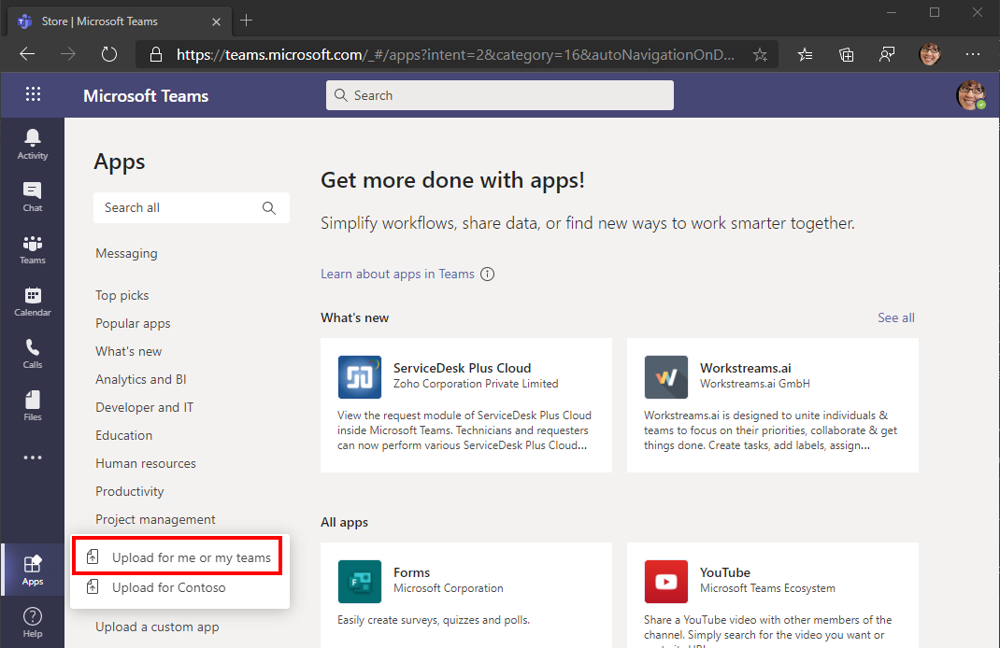

<!-- markdownlint-disable MD002 MD041 -->

Dans cet exercice, vous allez étendre l’application de l’exercice précédent pour prendre en charge l’authentification unique avec Azure AD. Cette opération est obligatoire pour obtenir le jeton d’accès OAuth nécessaire pour appeler l’API Microsoft Graph. Dans cette étape, vous allez configurer la bibliothèque [Microsoft. Identity. Web](https://www.nuget.org/packages/Microsoft.Identity.Web/) .

> [!IMPORTANT]
> Pour éviter le stockage de l’ID et de la clé secrète de l’application dans la source, utilisez le [Gestionnaire de secret .net](/aspnet/core/security/app-secrets) pour stocker ces valeurs. Le gestionnaire de secrets est destiné uniquement à des fins de développement, les applications de production doivent utiliser un gestionnaire de secret approuvé pour le stockage de secrets.

1. Ouvrez **./appsettings.jssur** et remplacez son contenu par ce qui suit.

    :::code language="json" source="../demo/GraphTutorial/appsettings.example.json" highlight="2-8":::

1. Ouvrez la CLI dans le répertoire où se trouve **GraphTutorial. csproj** , puis exécutez les commandes suivantes, en remplaçant `YOUR_APP_ID` votre ID d’application dans le portail Azure, et `YOUR_APP_SECRET` votre clé d’application secrète.

    ```Shell
    dotnet user-secrets init
    dotnet user-secrets set "AzureAd:ClientId" "YOUR_APP_ID"
    dotnet user-secrets set "AzureAd:ClientSecret" "YOUR_APP_SECRET"
    ```

## <a name="implement-sign-in"></a>Implémentation de la connexion

Tout d’abord, implémentez l’authentification unique dans le code JavaScript de l’application. Vous allez utiliser le [Kit de développement logiciel (SDK) Microsoft teams JavaScript](/javascript/api/overview/msteams-client) pour obtenir un jeton d’accès qui permet au code JavaScript exécuté dans le client teams d’effectuer des appels AJAX vers l’API Web que vous allez implémenter ultérieurement.

1. Ouvrez **./pages/index.cshtml** et ajoutez le code suivant à l’intérieur de la `<script>` balise.

    ```javascript
    (function () {
      if (microsoftTeams) {
        microsoftTeams.initialize();

        microsoftTeams.authentication.getAuthToken({
          successCallback: (token) => {
            // TEMPORARY: Display the access token for debugging
            $('#tab-container').empty();

            $('<code/>', {
              text: token,
              style: 'word-break: break-all;'
            }).appendTo('#tab-container');
          },
          failureCallback: (error) => {
            renderError(error);
          }
        });
      }
    })();

    function renderError(error) {
      $('#tab-container').empty();

      $('<h1/>', {
        text: 'Error'
      }).appendTo('#tab-container');

      $('<code/>', {
        text: JSON.stringify(error, Object.getOwnPropertyNames(error)),
        style: 'word-break: break-all;'
      }).appendTo('#tab-container');
    }
    ```

    Cela appelle le `microsoftTeams.authentication.getAuthToken` pour s’authentifier silencieusement en tant qu’utilisateur connecté à Teams. Il n’existe généralement aucune invite d’interface utilisateur, sauf si l’utilisateur doit consentir. Le code affiche ensuite le jeton sous l’onglet.

1. Enregistrez vos modifications et démarrez votre application en exécutant la commande suivante dans votre interface CLI.

    ```Shell
    dotnet run
    ```

    > [!IMPORTANT]
    > Si vous avez redémarré ngrok et que votre URL ngrok a changé, veillez à mettre à jour la valeur ngrok à l’emplacement suivant **avant** de procéder au test.
    >
    > - L’URI de redirection dans l’inscription de votre application
    > - URI de l’ID d’application dans l’inscription de votre application
    > - `contentUrl` dans manifest.jssur
    > - `validDomains` dans manifest.jssur
    > - `resource` dans manifest.jssur

1. Créez un fichier ZIP avec **manifest.js**, **color.png** et **outline.png**.

1. Dans Microsoft Teams, sélectionnez **applications** dans la barre de gauche, sélectionnez **Télécharger une application personnalisée**, puis **Télécharger pour moi ou My teams**.

    

1. Naviguez jusqu’au fichier ZIP que vous avez créé précédemment, puis sélectionnez **ouvrir**.

1. Passez en revue les informations relatives à l’application, puis sélectionnez **Ajouter**.

1. L’application s’ouvre dans teams et affiche un jeton d’accès.

Si vous copiez le jeton, vous pouvez le coller dans [JWT.ms](https://jwt.ms). Vérifiez que l’audience (la `aud` revendication) est l’ID de votre application et que la seule portée (la `scp` revendication) est l’étendue de l' `access_as_user` API que vous avez créée. Cela signifie que ce jeton n’accorde pas d’accès direct à Microsoft Graph ! Au lieu de cela, l’API Web que vous implémenterez bientôt devra échanger ce jeton à l’aide du flux de la [part de](/azure/active-directory/develop/v2-oauth2-on-behalf-of-flow) pour obtenir un jeton qui fonctionnera avec les appels Microsoft Graph.

## <a name="configure-authentication-in-the-aspnet-core-app"></a>Configurer l’authentification dans l’application principale de ASP.NET

Commencez par ajouter les services de plateforme d’identité Microsoft à l’application.

1. Ouvrez le fichier **./Startup.cs** et ajoutez l' `using` instruction suivante en haut du fichier.

    ```csharp
    using Microsoft.Identity.Web;
    ```

1. Ajoutez la ligne suivante juste avant la `app.UseAuthorization();` ligne dans la `Configure` fonction.

    ```csharp
    app.UseAuthentication();
    ```

1. Ajoutez la ligne suivante juste après la `endpoints.MapRazorPages();` ligne dans la `Configure` fonction.

    ```csharp
    endpoints.MapControllers();
    ```

1. Remplacez la fonction `ConfigureServices` existante par ce qui suit.

    :::code language="csharp" source="../demo/GraphTutorial/Startup.cs" id="ConfigureServicesSnippet":::

    Ce code configure l’application pour permettre aux appels aux API Web d’être authentifiés en fonction du jeton du porteur JWT dans l' `Authorization` en-tête. Il ajoute également les services d’acquisition de jetons qui peuvent échanger ce jeton via le flux de la part de.

## <a name="create-the-web-api-controller"></a>Créer le contrôleur d’API Web

1. Créez un répertoire dans la racine du projet nommé **contrôleurs**.

1. Créez un fichier dans le répertoire **./Controllers** nommé **CalendarController.cs** et ajoutez le code suivant.

    ```csharp
    using System;
    using System.Collections.Generic;
    using System.Net;
    using System.Threading.Tasks;
    using Microsoft.AspNetCore.Authorization;
    using Microsoft.AspNetCore.Http;
    using Microsoft.AspNetCore.Mvc;
    using Microsoft.Extensions.Logging;
    using Microsoft.Identity.Web;
    using Microsoft.Identity.Web.Resource;
    using Microsoft.Graph;
    using TimeZoneConverter;

    namespace GraphTutorial.Controllers
    {
        [ApiController]
        [Route("[controller]")]
        [Authorize]
        public class CalendarController : ControllerBase
        {
            private static readonly string[] apiScopes = new[] { "access_as_user" };

            private readonly GraphServiceClient _graphClient;
            private readonly ITokenAcquisition _tokenAcquisition;
            private readonly ILogger<CalendarController> _logger;

            public CalendarController(ITokenAcquisition tokenAcquisition, GraphServiceClient graphClient, ILogger<CalendarController> logger)
            {
                _tokenAcquisition = tokenAcquisition;
                _graphClient = graphClient;
                _logger = logger;
            }

            [HttpGet]
            public async Task<string> Get()
            {
                // This verifies that the access_as_user scope is
                // present in the bearer token, throws if not
                HttpContext.VerifyUserHasAnyAcceptedScope(apiScopes);

                // To verify that the identity libraries have authenticated
                // based on the token, log the user's name
                _logger.LogInformation($"Authenticated user: {User.GetDisplayName()}");

                try
                {
                    // TEMPORARY
                    // Get a Graph token via OBO flow
                    var token = await _tokenAcquisition
                        .GetAccessTokenForUserAsync(new[]{
                            "User.Read",
                            "MailboxSettings.Read",
                            "Calendars.ReadWrite" });

                    // Log the token
                    _logger.LogInformation($"Access token for Graph: {token}");
                    return "{ \"status\": \"OK\" }";
                }
                catch (MicrosoftIdentityWebChallengeUserException ex)
                {
                    _logger.LogError(ex, "Consent required");
                    // This exception indicates consent is required.
                    // Return a 403 with "consent_required" in the body
                    // to signal to the tab it needs to prompt for consent
                    HttpContext.Response.ContentType = "text/plain";
                    HttpContext.Response.StatusCode = (int)HttpStatusCode.Forbidden;
                    await HttpContext.Response.WriteAsync("consent_required");
                    return null;
                }
                catch (Exception ex)
                {
                    _logger.LogError(ex, "Error occurred");
                    return null;
                }
            }
        }
    }
    ```

    Cela implémente une API Web ( `GET /calendar` ) qui peut être appelée à partir de l’onglet Teams. Pour l’instant, il essaie simplement d’échanger le jeton du porteur pour un jeton de graphique. La première fois qu’un utilisateur charge l’onglet, cette opération échoue car elle n’a pas encore accepté d’autoriser l’accès de l’application à Microsoft Graph en son nom.

1. Ouvrez **./pages/index.cshtml** et remplacez la `successCallback` fonction par ce qui suit.

    ```javascript
    successCallback: (token) => {
      // TEMPORARY: Call the Web API
      fetch('/calendar', {
        headers: {
          'Authorization': `Bearer ${token}`
        }
      }).then(response => {
        response.text()
          .then(body => {
            $('#tab-container').empty();
            $('<code/>', {
              text: body
            }).appendTo('#tab-container');
          });
      }).catch(error => {
        console.error(error);
        renderError(error);
      });
    }
    ```

    Cela appelle l’API Web et affiche la réponse.

1. Enregistrez vos modifications, puis redémarrez l’application. Actualisez l’onglet dans Microsoft Teams. La page doit s’afficher `consent_required` .

1. Examinez la sortie du journal dans votre interface CLI. Notez deux choses.

    - Une entrée comme `Authenticated user: MeganB@contoso.com` . L’API Web a authentifié l’utilisateur en fonction du jeton envoyé avec la demande d’API.
    - Une entrée comme `AADSTS65001: The user or administrator has not consented to use the application with ID...` . Cela est normal, car l’utilisateur n’a pas encore été invité à accepter les étendues d’autorisation Microsoft Graph demandées.

## <a name="implement-consent-prompt"></a>Mettre en œuvre une invite de consentement

Étant donné que l’API Web ne peut pas inviter l’utilisateur, l’onglet teams doit mettre en œuvre une invite. Cette opération ne doit être exécutée qu’une seule fois pour chaque utilisateur. Une fois qu’un utilisateur est accepté, il n’a pas besoin de reverser le consentement, sauf s’il refuse explicitement l’accès à votre application.

1. Créez un fichier dans le répertoire **./pages** nommé **Authenticate.cshtml.cs** et ajoutez le code suivant.

    :::code language="csharp" source="../demo/GraphTutorial/Pages/Authenticate.cshtml.cs" id="AuthenticateModelSnippet":::

1. Créez un fichier dans le répertoire **./pages** nommé **Authenticate. cshtml** et ajoutez le code suivant.

    :::code language="razor" source="../demo/GraphTutorial/Pages/Authenticate.cshtml":::

1. Créez un fichier dans le répertoire **./pages** nommé **AuthComplete. cshtml** et ajoutez le code suivant.

    :::code language="razor" source="../demo/GraphTutorial/Pages/AuthComplete.cshtml":::

1. Ouvrez **./pages/index.cshtml** et ajoutez les fonctions suivantes à l’intérieur de la `<script>` balise.

    :::code language="javascript" source="../demo/GraphTutorial/Pages/Index.cshtml" id="LoadUserCalendarSnippet":::

1. Ajoutez la fonction suivante dans la `<script>` balise pour afficher un résultat réussi de l’API Web.

    ```javascript
    function renderCalendar(events) {
      $('#tab-container').empty();

      $('<pre/>').append($('<code/>', {
        text: JSON.stringify(events, null, 2),
        style: 'word-break: break-all;'
      })).appendTo('#tab-container');
    }
    ```

1. Remplacez le `successCallback` code existant par le code suivant.

    ```javascript
    successCallback: (token) => {
      loadUserCalendar(token, (events) => {
        renderCalendar(events);
      });
    }
    ```

1. Enregistrez vos modifications, puis redémarrez l’application. Actualisez l’onglet dans Microsoft Teams. L’onglet doit s’afficher `{ "status": "OK" }` .

1. Examinez la sortie du journal. L’entrée doit apparaître `Access token for Graph` . Si vous analysez ce jeton, vous remarquerez qu’il contient les étendues Microsoft Graph configurées dans **appsettings.jsactivé**.

## <a name="storing-and-refreshing-tokens"></a>Stockage et actualisation des jetons

À ce stade, votre application a un jeton d’accès, qui est envoyé dans l' `Authorization` en-tête des appels d’API. Il s’agit du jeton qui permet à l’application d’accéder à Microsoft Graph pour le compte de l’utilisateur.

Cependant, ce jeton est de courte durée. Le jeton expire une heure après son émission. C’est là que le jeton d’actualisation devient utile. Le jeton d’actualisation permet à l’application de demander un nouveau jeton d’accès sans obliger l’utilisateur à se reconnecter.

Étant donné que l’application utilise la bibliothèque Microsoft. Identity. Web, vous n’avez pas besoin d’implémenter de logique d’actualisation ou de stockage de jetons.

L’application utilise le cache de jetons en mémoire, ce qui est suffisant pour les applications qui n’ont pas besoin de faire persister les jetons lors du redémarrage de l’application. Les applications de production peuvent utiliser à la place les [options de cache distribué](https://github.com/AzureAD/microsoft-identity-web/wiki/token-cache-serialization) dans la bibliothèque Microsoft. Identity. Web.

La `GetAccessTokenForUserAsync` méthode gère l’expiration du jeton et l’actualisation pour vous. Il vérifie d’abord le jeton mis en cache et, s’il n’a pas expiré, il le renvoie. Si elle a expiré, elle utilise le jeton d’actualisation mis en cache pour en obtenir une nouvelle.

La **GraphServiceClient** que les contrôleurs obtiennent via l’injection de dépendances est préconfigurée avec un fournisseur d’authentification qui se sert `GetAccessTokenForUserAsync` pour vous.
