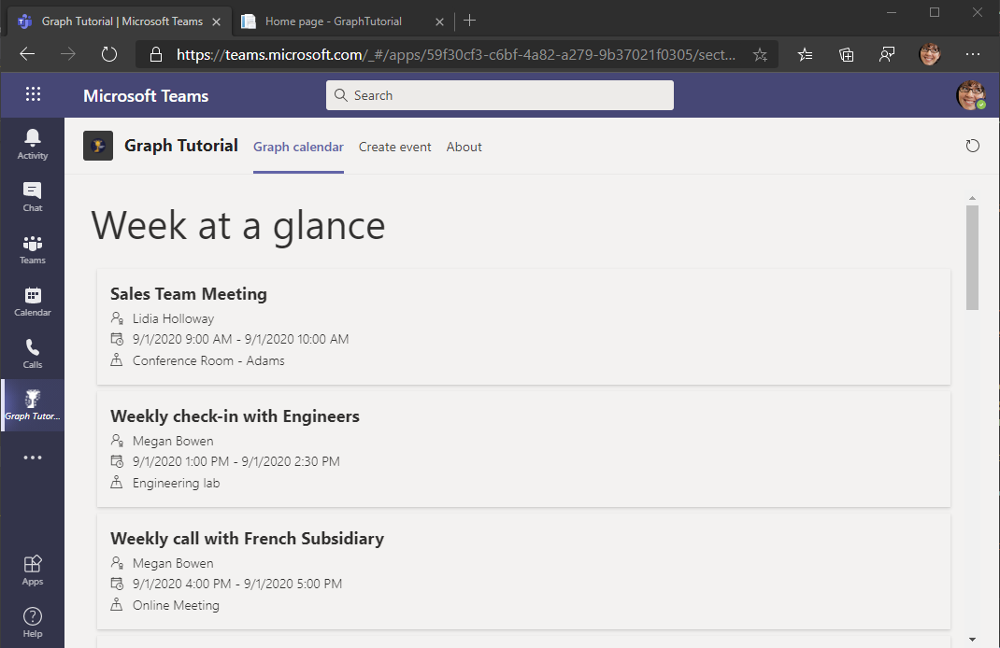

<!-- markdownlint-disable MD002 MD041 -->

Dans cette section, vous allez incorporer Microsoft Graph dans l’application.In this section you will incorporate Microsoft Graph into the application. Pour cette application, vous allez utiliser la [bibliothèque cliente Microsoft Graph pour .net](https://github.com/microsoftgraph/msgraph-sdk-dotnet) pour effectuer des appels à Microsoft Graph.For this application, you will use the [Microsoft Graph Client Library for .NET](https://github.com/microsoftgraph/msgraph-sdk-dotnet) to make calls to Microsoft Graph.

# Obtenir un affichage CalendrierGet a calendar view

Un affichage Calendrier est un ensemble d’événements provenant du calendrier de l’utilisateur qui se produit entre deux moments.A calendar view is a set of events from the user's calendar that occur between two points of time. Vous l’utiliserez pour obtenir les événements de l’utilisateur pour la semaine en cours.You'll use this to get the user's events for the current week.

1. Ouvrez **./Controllers/CalendarController.cs** et ajoutez la fonction suivante à la classe **CalendarController** .Open **./Controllers/CalendarController.cs** and add the following function to the **CalendarController** class.

    :::code language="csharp" source="../demo/GraphTutorial/Controllers/CalendarController.cs" id="GetStartOfWeekSnippet":::

1. Ajoutez la fonction suivante pour gérer les exceptions renvoyées par les appels Microsoft Graph.Add the following function to handle exceptions returned from Microsoft Graph calls.

    :::code language="csharp" source="../demo/GraphTutorial/Controllers/CalendarController.cs" id="HandleGraphExceptionSnippet":::

1. Remplacez la fonction `Get` existante par ce qui suit.Replace the existing `Get` function with the following.

    :::code language="csharp" source="../demo/GraphTutorial/Controllers/CalendarController.cs" id="GetSnippet" highlight="2,14-57":::

    Passez en revue les modifications.Review the changes. Cette nouvelle version de la fonction :This new version of the function:

    - Renvoie à la `IEnumerable<Event>` place de `string` .Returns `IEnumerable<Event>` instead of `string`.
    - Obtient les paramètres de boîte aux lettres de l’utilisateur à l’aide de Microsoft Graph.Gets the user's mailbox settings using Microsoft Graph.
    - Utilise le fuseau horaire de l’utilisateur pour calculer le début et la fin de la semaine en cours.Uses the user's time zone to calculate the start and end of the current week.
    - Obtient une vue de calendrierGets a calendar view
        - Utilise la `.Header()` fonction pour inclure un `Prefer: outlook.timezone` en-tête, ce qui entraîne la conversion des événements renvoyés en fuseau horaire de l’utilisateur.Uses the `.Header()` function to include a `Prefer: outlook.timezone` header, which causes the returned events to have their start and end times converted to the user's timezone.
        - Utilise la `.Top()` fonction pour demander au plus 50 événements.Uses the `.Top()` function to request at most 50 events.
        - Utilise la `.Select()` fonction pour demander uniquement les champs utilisés par l’application.Uses the `.Select()` function to request just the fields used by the app.
        - Utilise la `OrderBy()` fonction pour trier les résultats en fonction de l’heure de début.Uses the `OrderBy()` function to sort the results by the start time.

1. Enregistrez vos modifications, puis redémarrez l’application.Save your changes and restart the app. Actualisez l’onglet dans Microsoft Teams.Refresh the tab in Microsoft Teams. L’application affiche une liste JSON des événements.The app displays a JSON listing of the events.

## Afficher les résultatsDisplay the results

À présent, vous pouvez afficher la liste des événements de manière plus conviviale.Now you can display the list of events in a more user friendly way.

1. Ouvrez **./pages/index.cshtml** et ajoutez les fonctions suivantes à l’intérieur de la `<script>` balise.Open **./Pages/Index.cshtml** and add the following functions inside the `<script>` tag.

    :::code language="javascript" source="../demo/GraphTutorial/Pages/Index.cshtml" id="RenderHelpersSnippet":::

1. Remplacez la fonction `renderCalendar` existante par ce qui suit.Replace the existing `renderCalendar` function with the following.

    :::code language="javascript" source="../demo/GraphTutorial/Pages/Index.cshtml" id="RenderCalendarSnippet":::

1. Enregistrez vos modifications, puis redémarrez l’application.Save your changes and restart the app. Actualisez l’onglet dans Microsoft Teams.Refresh the tab in Microsoft Teams. L’application affiche les événements sur le calendrier de l’utilisateur.The app displays events on the user's calendar.

    
